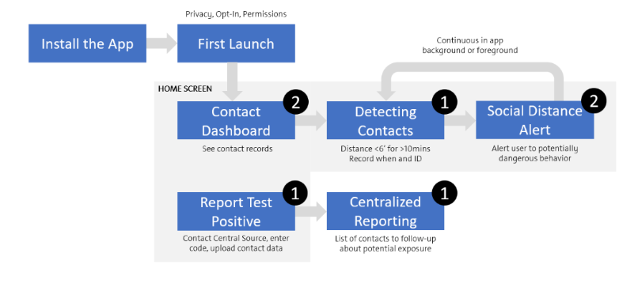
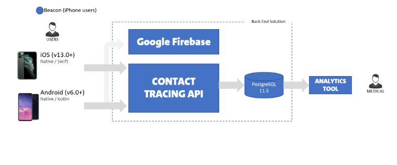

[](https://opensource.org/licenses/Apache-2.0)

# Contact Tracing App Android 

## Who are we? What is this app?

This document is focused on the implementation of the Android version of the Contact Tracing app. This app uses the CovidWatch base for which more information can be found at [CovidWatch Android](https://github.com/covidwatchorg/covidwatch-android-tcn)  When installed, the Contact Tracing App provides the follow capabilities:

- Allows users to record contact interactions locally (Contact Definition: Less than 6ft for a period of 10+ minutes) with others using the [TCN Protocol](https://github.com/TCNCoalition/tcn-client-android)
- Uses a rotating Key for identification
- Notifies users if someone they have interacted with in the past 14 days indicates they tested positive for COVID-19
- Allows users to send contact data back to a centralized source if they tested positive for COVID-19
- Proactively alerts a user if the user is in proximity to another user (both users must have the app running for detection)
- Displays key statistics to the user regarding daily interactions
- iBeacon support for iOS -> Android interactions

## Application Flow



## Application Architecture



## Setup

Clone this repo from the `master` branch:

Open the project in Android Studio to install with the `app` configuration. 

Download and run backend services required for this app which can be found at [Contact Tracing Services](https://github.com/generalmotors/contact-tracing-mobile-app-backend)

Firebase Cloud Functions also need to be setup with codebase and README of this [commit](https://github.com/covidwatchorg/covidwatch-cloud-functions/commit/5fc89bee2e15433f55b4e2c8036f2ce13c23d2a3) in the [CovidWatch Cloud Functions](https://github.com/covidwatchorg/covidwatch-cloud-functions) repo. 

```
git clone https://github.com/covidwatchorg/covidwatch-cloud-functions.git
```
```
git checkout 5fc89bee2e15433f55b4e2c8036f2ce13c23d2a3 
```

Once Firebase is configured, create and replace the `google-services.json` in the Android project with one from your instance. 

Update the API URL in the following files to the url of your [Contact Tracing Services](https://github.com/generalmotors/contact-tracing-mobile-app-backend) instance.

- org.tcncoalition.tcnclient.TcnConstants
- com.contacttracer.GlobalConstants

 For full app functionality, both the [Contact Tracing Services](https://github.com/generalmotors/contact-tracing-mobile-app-backend) as well as the Firebase functions referenced [commit](https://github.com/covidwatchorg/covidwatch-cloud-functions/commit/5fc89bee2e15433f55b4e2c8036f2ce13c23d2a3) need to be configured and running.

## iBeacon TCN Retrieval

When a device detects the iOS user’s beacon it has to pull the TCN from the backend and store it in the user's local phone for contact detection and COVID + trigger.

## Post User’s Phone Number

When user reports COVID positive the phone number is posted to backend API and also when the device detects the user as a potential infectious user

**Note:** You cannot run this app on an emulator! It is dependent on Bluetooth being on and active, and most standard Android emulators do not have Bluetooth drivers.

## FAQ

What is the anonymous protocol for communication between phones? How does it work and who designed it?

Covid Watch uses Temporary Contact Numbers, a decentralized, privacy-first contact tracing protocol developed by the [TCN Coalition](https://tcn-coalition.org/). This protocol is built to be extensible, with the goal of providing interoperability between contact tracing applications. You can read more about it on their [Github](https://github.com/TCNCoalition/TCN).

## Contributors

- Shane McCutchen
- Dan Rudman (@dantelope)
- Naveen Sankar (@naveenatgm)
- Sukhdev Tur 
- Joshua Noble (@joshuanoble)
- Zane Schepke (@zaneschepke)
- Mike Schuplin 
- Mark Celani
- Peter Wyatt
- Jeff Blumenthal
- Yara Lott
- Chris McGraw
- Eric Crichlow
- Jonathan Wilson
- Sam Jamal
